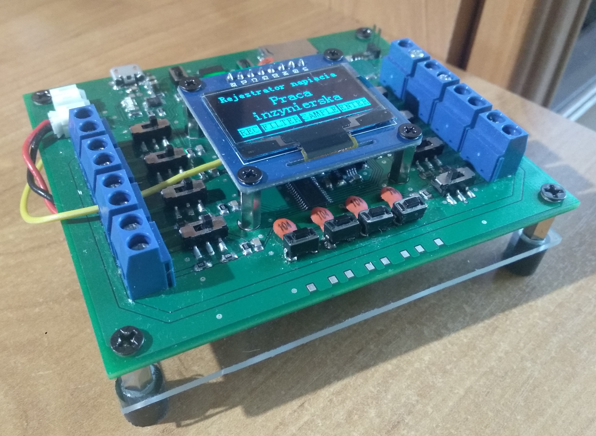

  

# VoltageRecorder
Celem projektu było zaprojektowanie, montaż i uruchomienie wielokanałowego rejestratora danych do precyzyjnego pomiaru napięcia(The aim of the project was to design, assemble and launch Multi-channel data logger for precise voltage measurement). My engineer's thesis.

# Cel i zakres pracy
Celem pracy jest zaprojektowanie oraz budowa rejestratora do precyzyjnego pomiaru napięcia o zasilaniu bateryjnym. Urządzenie to musi pozwolić na szybką archiwizację danych oraz zapisanie ich w postaci cyfrowej na nieulotną pamięć FLASH. Zbieranie i rejestracja danych na nośnik pamięci o odpowiedniej pojemności pozwala ponadto na prowadzenie wielogodzinnych pomiarów. Aby osiągnąć cel został wykonany schemat elektryczny urządzenia, a następnie na jego podstawie wykonana płytka PCB. Drugim krokiem będzie stworzenie algorytmu w języku C, w celu obsługi podzespołów oraz zarządzania danymi. Zostanie stworzony prosty interfejs użytkownika umożliwiający ustawienie parametrów archiwizacji (ilość próbek na sekundę, zakres pomiarowy), prezentację wyników oraz kalibracje urządzenia.
Ostatnim krokiem była doświadczalna weryfikacja działania układu oraz próba określenia uzyskanych parametrów.